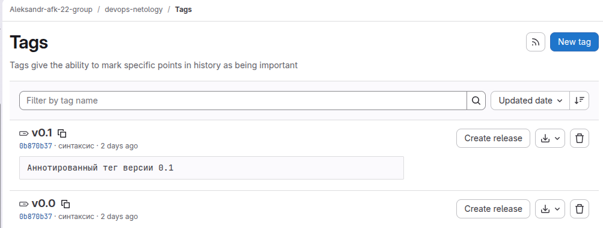
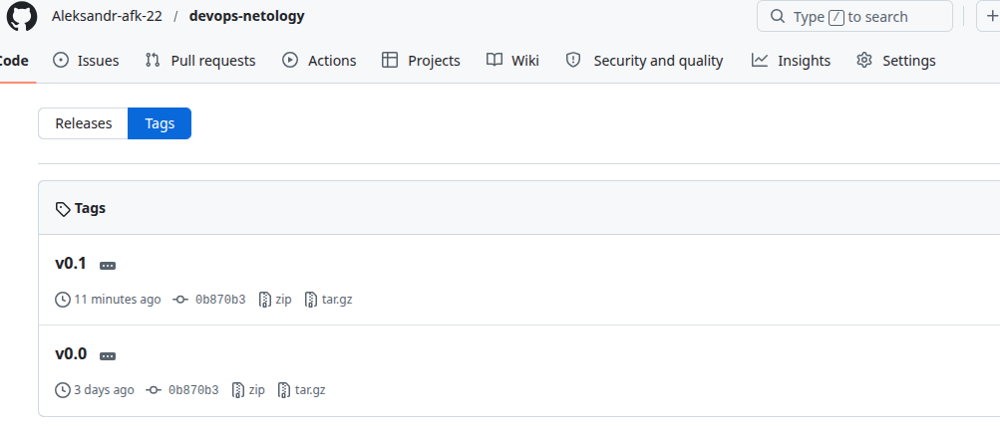
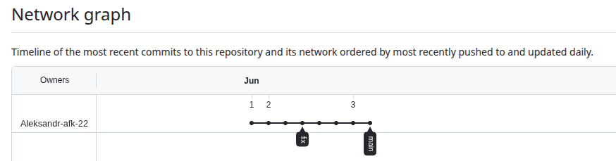

# devops-netology

## задание №1 "Основы Git"

**Клонирование репозитория**
```
git clone https://github.com/Aleksandr-afk-22/devops-netology.git

aleks@aleks-nb:~/project/devops-netology/devops-netology$ ls -la
total 16
drwxrwxr-x 3 aleks aleks 4096 Jun  1 21:27 .
drwxrwxr-x 3 aleks aleks 4096 Jun  1 21:27 ..
drwxrwxr-x 7 aleks aleks 4096 Jun  1 21:27 .git
-rw-rw-r-- 1 aleks aleks   17 Jun  1 21:27 README.md
aleks@aleks-nb:~/project/devops-netology/devops-netology$ git remote -v
origin	https://github.com/Aleksandr-afk-22/devops-netology.git (fetch)
origin	https://github.com/Aleksandr-afk-22/devops-netology.git (push)
aleks@aleks-nb:~/project/devops-netology/devops-netology$ 

```
**Первоначальная настройка Git**
```
git config --global user.name "Aleksandr"
git config --global user.email "asimaev@gmail.com"
 git config --global --list
user.name=Aleksandr
user.email=asimaev@gmail.com

```
**Проверка Статуса**
```
git status
Текущая ветка: main
Эта ветка соответствует «origin/main».

нечего коммитить, нет изменений в рабочем каталоге

```
**Внесение изменений команды git diff, git diff --staged, первый коммит**
```
aleks@aleks-nb:~/project/devops-netology/devops-netology$ git diff
diff --git a/README.md b/README.md
index 647b370..56e3025 100644
--- a/README.md
+++ b/README.md
@@ -1 +1,3 @@
-# devops-netology
\ No newline at end of file
+# devops-netology
+**Клонирование репозитория**
+
aleks@aleks-nb:~/project/devops-netology/devops-netology$ git diff --staged 
aleks@aleks-nb:~/project/devops-netology/devops-netology$ git add README.md 
aleks@aleks-nb:~/project/devops-netology/devops-netology$ git diff
aleks@aleks-nb:~/project/devops-netology/devops-netology$ git diff --staged 
diff --git a/README.md b/README.md
index 647b370..56e3025 100644
--- a/README.md
+++ b/README.md
@@ -1 +1,3 @@
-# devops-netology
\ No newline at end of file
+# devops-netology
+**Клонирование репозитория**
+
aleks@aleks-nb:~/project/devops-netology/devops-netology$ git commit -m 'First commit'
[main 7d61e79] First commit
 1 file changed, 3 insertions(+), 1 deletion(-)
aleks@aleks-nb:~/project/devops-netology/devops-netology$ git status
Текущая ветка: main
Ваша ветка опережает «origin/main» на 1 коммит.
  (используйте «git push», чтобы опубликовать ваши локальные коммиты)

нечего коммитить, нет изменений в рабочем каталоге
aleks@aleks-nb:~/project/devops-netology/devops-netology$ git diff
aleks@aleks-nb:~/project/devops-netology/devops-netology$ git diff --staged 
aleks@aleks-nb:~/project/devops-netology/devops-netology$ 
```
**Создание файлов .gitignore и второго коммита**
```
git status
Текущая ветка: main
Ваша ветка опережает «origin/main» на 1 коммит.
  (используйте «git push», чтобы опубликовать ваши локальные коммиты)

Неотслеживаемые файлы:
  (используйте «git add <файл>...», чтобы добавить в то, что будет включено в коммит)
        .gitignore

индекс пуст, но есть неотслеживаемые файлы
(используйте «git add», чтобы проиндексировать их)
git add ./.gitignore 
git status
Текущая ветка: main
Ваша ветка опережает «origin/main» на 1 коммит.
  (используйте «git push», чтобы опубликовать ваши локальные коммиты)

Изменения, которые будут включены в коммит:
  (используйте «git restore --staged <файл>...», чтобы убрать из индекса)
        новый файл:    .gitignore
```
**создание директории terraform и внутри этой директории — файл .gitignore по примеру: https://github.com/github/gitignore/blob/master/Terraform.gitignore.**
```
aleks@aleks-nb:~/project/devops-netology/devops-netology$ tree -a terraform/
terraform/
└── .gitignore

1 directory, 1 file
```
**Игнорируемые файлы (.gitignore)**
- **Состояния Terraform** (`*.tfstate`, `.terraform/`) — содержат инфраструктурные данные и потенциальные секреты.
- **Переменные с секретами** (`*.tfvars`, `*.tfvars.json`) — пароли, ключи доступа, приватные данные.
- **Логи и временные файлы** (`crash.log`, `.terraform.tfstate.lock.info`) — служебная информация.
- **Локальные переопределения** (`override.tf`) — файлы для локального тестирования, не предназначенные для общего репозитория.
- **Конфигурации CLI** (`.terraformrc`) — локальные настройки пользователя.

**Доработка**
 - `.terraform/` Все файлы и подкаталоги внутри любой директории с именем .terraform
 - `*.tfstate` Все файлы, имя которых заканчивается на .tfstate (включая файл .tfstate)
 - `*.tfstate.*` Все файлы в названии которых содержится .tfstate.
 - `*.tfvars` Все файлы, имя которых заканчивается на .tfvars (включая файл .tfvars)
 - `*.tfvars.json` Все файлы, имя которых заканчивается на .tfvars.json (включая .tfvars.json)
 - `crash.log` Только файлы с именем crash.log
 - `crash.*.log` Все файлы, начинающиеся с crash., заканчивающиеся на .log, и имеющие любые символы между точками
 - `override.tf` Только файлы с именем override.tf
 - `*_override.tf` Все файлы, заканчивающиеся на _override.tf
 - `*_override.tf.json` Все файлы, заканчивающиеся на _override.tf.json
 - `override.tf.json` Только файлы с именем override.tf.json
 - `.terraformrc` Файл с именем .terraformrc
 - `terraform.rc` Файл с именем terraform.rc
 - `.terraform.tfstate.lock.info` Только файл с именем .terraform.tfstate.lock.info
 
**Эксперимент с удалением и перемещением файлов (третий и четвёртый коммит)**
```
echo "will_be_deleted" > will_be_deleted.txt
echo "will_be_moved" > will_be_moved.txt
git add will_be_deleted.txt will_be_moved.txt
git commit -m "Prepare to delete and move."
[main 34aaf09] Prepare to delete and move.
 2 files changed, 2 insertions(+)
 create mode 100644 will_be_deleted.txt
 create mode 100644 will_be_moved.txt
git log --oneline -1
34aaf09 (HEAD -> main) Prepare to delete and move.
git rm will_be_deleted.txt
git mv will_be_moved.txt has_been_moved.txt
ls -l
total 20
-rw-rw-r-- 1 aleks aleks 5279 Jun  2 08:04 README.md
-rw-rw-r-- 1 aleks aleks   14 Jun  2 12:43 has_been_moved.txt
git status
Текущая ветка: main
Ваша ветка опережает «origin/main» на 3 коммита.
  (используйте «git push», чтобы опубликовать ваши локальные коммиты)

Изменения, которые будут включены в коммит:
  (используйте «git restore --staged <файл>...», чтобы убрать из индекса)
	переименовано: will_be_moved.txt -> has_been_moved.txt
	удалено:       will_be_deleted.txt
git commit -m "Moved and deleted."
[main 0409ae7] Moved and deleted.
 2 files changed, 1 deletion(-)
 rename will_be_moved.txt => has_been_moved.txt (100%)
 delete mode 100644 will_be_deleted.txt
```
**Проверка изменений**
```
aleks@aleks-nb:~/project/devops-netology/devops-netology$ git log
commit 0409ae7dea4ead9060f5a0c4d443fbf5ce87d4b2 (HEAD -> main)
Author: Aleksandr <asimaev@gmail.com>
Date:   Tue Jun 2 12:56:14 2026 +0300

    Moved and deleted.

commit 34aaf09b11b9b78d411d79d01b113a7546e0cac3
Author: Aleksandr <asimaev@gmail.com>
Date:   Tue Jun 2 12:44:33 2026 +0300

    Prepare to delete and move.

commit 4e1c21af44952e77061dc6003740564b1b692766
Author: Aleksandr <asimaev@gmail.com>
Date:   Tue Jun 2 08:07:09 2026 +0300

    Added gitignore

commit 7d61e79af5b7e16f61f9beab1499f990abb1c3b0
Author: Aleksandr <asimaev@gmail.com>
Date:   Tue Jun 2 07:26:23 2026 +0300

    First commit

commit 195b8b270edbe8f69a61294d64c5db2fd3ea6911 (origin/main, origin/HEAD)
Author: Aleksandr-afk-22 <asimaev@gmail.com>
Date:   Mon Jun 1 19:47:17 2026 +0300

    Initial commit
aleks@aleks-nb:~/project/devops-netology/devops-netology$ 

```
## Задание №2 "Основы Git"

**проверка внешних репозиториев**
```
aleks@aleks-nb:~/project/devops-netology/devops-netology$ git remote -v
origin	https://github.com/Aleksandr-afk-22/devops-netology.git (fetch)
origin	https://github.com/Aleksandr-afk-22/devops-netology.git (push)
aleks@aleks-nb:~/project/devops-netology/devops-netology$ 

```
**добавляем дополнительный репозиторий**
```
aleks@aleks-nb:~/project/devops-netology/devops-netology$ git remote add gitlab git@gitlab.com:aleksandr-afk-22-group/devops-netology.git
aleks@aleks-nb:~/project/devops-netology/devops-netology$ git remote -v
gitlab	git@gitlab.com:aleksandr-afk-22-group/devops-netology.git (fetch)
gitlab	git@gitlab.com:aleksandr-afk-22-group/devops-netology.git (push)
origin	https://github.com/Aleksandr-afk-22/devops-netology.git (fetch)
origin	https://github.com/Aleksandr-afk-22/devops-netology.git (push)
aleks@aleks-nb:~/project/devops-netology/devops-netology$ 

```
**отправка проекта в новый репозиторий**
```
aleks@aleks-nb:~/project/devops-netology/devops-netology$ git push -u gitlab main
The authenticity of host 'gitlab.com (172.65.251.78)' can't be established.
ED25519 key fingerprint is: SHA256:eUXGGm1YGsMAS7vkcx6JOJdOGHPem5gQp4taiCfCLB8
This key is not known by any other names.
Are you sure you want to continue connecting (yes/no/[fingerprint])? yes
Warning: Permanently added 'gitlab.com' (ED25519) to the list of known hosts.
Перечисление объектов: 27, готово.
Подсчет объектов: 100% (27/27), готово.
При сжатии изменений используется до 4 потоков
Сжатие объектов: 100% (20/20), готово.
Запись объектов: 100% (27/27), 5.74 KiB | 839.00 KiB/s, готово.
Total 27 (delta 7), reused 3 (delta 0), pack-reused 0 (from 0)
To gitlab.com:aleksandr-afk-22-group/devops-netology.git
 * [new branch]      main -> main
branch 'main' set up to track 'gitlab/main'.

```

### Теги
**проверка логов и текущего состояния**
```
aleks@aleks-nb:~/project/devops-netology/devops-netology$ git log --oneline -5
0b870b3 (HEAD -> main, origin/main, origin/HEAD, gitlab/main) синтаксис
3d2c5f8 доработки gitignore
0bda1b1 add README
0409ae7 Moved and deleted.
34aaf09 Prepare to delete and move.
aleks@aleks-nb:~/project/devops-netology/devops-netology$ 

```
создание легковесного тега
```
aleks@aleks-nb:~/project/devops-netology/devops-netology$ git tag v0.0
aleks@aleks-nb:~/project/devops-netology/devops-netology$ git tag -l
v0.0
aleks@aleks-nb:~/project/devops-netology/devops-netology$ git push origin v0.0
Username for 'https://github.com': Aleksandr-afk-22
Password for 'https://Aleksandr-afk-22@github.com': 
Total 0 (delta 0), reused 0 (delta 0), pack-reused 0 (from 0)
To https://github.com/Aleksandr-afk-22/devops-netology.git
 * [new tag]         v0.0 -> v0.0
aleks@aleks-nb:~/project/devops-netology/devops-netology$ git push gitlab v0.0
Total 0 (delta 0), reused 0 (delta 0), pack-reused 0 (from 0)
To gitlab.com:aleksandr-afk-22-group/devops-netology.git
 * [new tag]         v0.0 -> v0.0
aleks@aleks-nb:~/project/devops-netology/devops-netology$ 

```
создание аннотированного тега
```
aleks@aleks-nb:~/project/devops-netology/devops-netology$ git tag -a v0.1 -m "Аннотированный тег версии 0.1"
aleks@aleks-nb:~/project/devops-netology/devops-netology$ git tag -l
v0.0
v0.1
aleks@aleks-nb:~/project/devops-netology/devops-netology$ git show v0.1
tag v0.1
Tagger: Aleksandr <asimaev@gmail.com>
Date:   Sat Jun 6 08:12:52 2026 +0300

Аннотированный тег версии 0.1

commit 0b870b370668371770e8861c02da90b470b9b014 (HEAD -> main, tag: v0.1, tag: v0.0, origin/main, origin/HEAD, gitlab/main)

```
Аннотированный тег хранит в себе дополнительные метаданные: имя автора тега, email, дату создания и сообщение. Легковесный тег — это просто указатель на коммит.






### Ветки

проверка текущей ветки
```
aleks@aleks-nb:~/project/devops-netology/devops-netology$ git branch 
* main
```
переходим к коммиту с названием Prepare to delete and move
```
aleks@aleks-nb:~/project/devops-netology/devops-netology$ git log --oneline
0b870b3 (HEAD -> main, tag: v0.1, tag: v0.0, origin/main, origin/HEAD, gitlab/main) синтаксис
3d2c5f8 доработки gitignore
0bda1b1 add README
0409ae7 Moved and deleted.
34aaf09 Prepare to delete and move.
4e1c21a Added gitignore
7d61e79 First commit
195b8b2 Initial commit
aleks@aleks-nb:~/project/devops-netology/devops-netology$ git checkout 34aaf09
Примечание: переключение на «34aaf09».

Вы сейчас в состоянии «отсоединённого указателя HEAD». Можете осмотреться,
внести экспериментальные изменения и зафиксировать их, также можете
отменить любые коммиты, созданные в этом состоянии, не затрагивая другие
ветки, переключившись обратно на любую ветку.

Если хотите создать новую ветку для сохранения созданных коммитов, можете
сделать это (сейчас или позже), используя команду switch с параметром -c.
Например:

  git switch -c <новая-ветка>

Или отмените эту операцию с помощью:

  git switch -

Отключите этот совет, установив переменную конфигурации
advice.detachedHead в значение false

HEAD сейчас на 34aaf09 Prepare to delete and move.
```
создаём новую ветку
```
aleks@aleks-nb:~/project/devops-netology/devops-netology$ git switch -c fix
Переключились на новую ветку «fix»
aleks@aleks-nb:~/project/devops-netology/devops-netology$ git branch 
* fix
  main
aleks@aleks-nb:~/project/devops-netology/devops-netology$ 
```
отправляем в репозиторий github
```
aleks@aleks-nb:~/project/devops-netology/devops-netology$ git push -u origin fix
Username for 'https://github.com': Aleksandr-afk-22
Password for 'https://Aleksandr-afk-22@github.com': 
Total 0 (delta 0), reused 0 (delta 0), pack-reused 0 (from 0)
remote: 
remote: Create a pull request for 'fix' on GitHub by visiting:
remote:      https://github.com/Aleksandr-afk-22/devops-netology/pull/new/fix
remote: 
To https://github.com/Aleksandr-afk-22/devops-netology.git
 * [new branch]      fix -> fix
branch 'fix' set up to track 'origin/fix'.
```



вносим изменения в README.md пушим в репозиторий GitHub
```
aleks@aleks-nb:~/project/devops-netology/devops-netology$ git log --oneline --graph --all
* fc53c57 (HEAD -> fix, origin/fix) изменён README.md в ветке FIX
| * 0b870b3 (tag: v0.1, tag: v0.0, origin/main, origin/HEAD, gitlab/main, main) синтаксис
| * 3d2c5f8 доработки gitignore
| * 0bda1b1 add README
| * 0409ae7 Moved and deleted.
|/  
* 34aaf09 Prepare to delete and move.
* 4e1c21a Added gitignore
* 7d61e79 First commit
* 195b8b2 Initial commit
aleks@aleks-nb:~/project/devops-netology/devops-netology$ 

```

